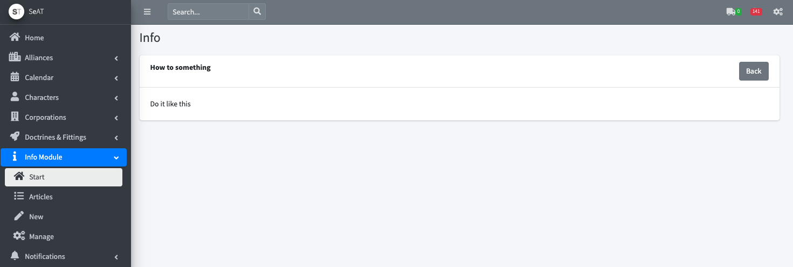

# SeAT-Info
SeAT-Info is a SeAT module that adds a small article systems for example as a corporation bulletin, or for explanations
on how to use seat.



## Usage

### Editor
The editor supports a markup language that's kinda close to HTML, but not quite.

Please read the [documentation](documentation.md).

### Access Management
Access is managed on a per-article and per-resource level using roles provided by the seat core. This allows for automatisation over 
squads as it is normally known. Additionally, there are a few fixed permission related to creating/modifying articles and resources.

## Installation
**This plugin requires special installation steps, please read the whole installation section!**

I can also recommend reading through the [official seat documentation](https://eveseat.github.io/docs/community_packages/).

### Docker Install

Open your .env file and edit the SEAT_PLUGINS variable to include the package.

```
# SeAT Plugins
SEAT_PLUGINS=recursivetree/seat-info
```

Now run
```
docker-compose up
```
and the plugin should be installed

### Barebone Install

In your seat directory:

```
sudo -H -u www-data bash -c 'php artisan down'
sudo -H -u www-data bash -c 'composer require recursivetree/seat-info'
sudo -H -u www-data bash -c 'php artisan vendor:publish --force --all'
sudo -H -u www-data bash -c 'php artisan migrate'
sudo -H -u www-data bash -c 'php artisan seat:cache:clear'
sudo -H -u www-data bash -c 'php artisan config:cache'
sudo -H -u www-data bash -c 'php artisan route:cache'
sudo -H -u www-data bash -c 'php artisan up'
```

## Changing the server settings
Per default, the configuration for the max allowed file size of php is rather low, meaning you can't upload big files in
the resources tab. This step isn't necessary if you don't want to upload files above 2 MB.

### Barebone
1. Open the `/etc/php/7.3/fpm/php.ini ` file, for example with nano:
    ```
    nano /etc/php/7.3/fpm/php.ini 
    ```
2. Change this line
    ```
    upload_max_filesize = 2M
    ```
    to 
    ```
    upload_max_filesize = [the max size you want in megabytes]M
    ```
3. Do the same for `post_max_size`, and if required for `memory_limit`. The value should be slightly larger than the value of`upload_max_filesize`.
4. Save and exit
5. Reload the config with:
    ```
    service php7.3-fpm reload
    service nginx reload
    ```
6. Reload the management page, and it should state a higher value as the limit.

### Docker
1. Go to the directory with your `docker-compose.yml` file, per default `/opt/seat-docker`.
2. In this directory, create a new file `seat_info.ini`.
3. Put the following in the `seat_info.ini` file:
   ```
   ; Increase the maximum file upload size for the seat-info plugin
   upload_max_filesize = 40M ; increase this to a value larger than the largest file you intend to upload
   post_max_size = 41M ; must be larger than upload_max_filesize
   ;memory_limit = 512M ;you might need to increase this too if you have huge files, don't forget to uncomment
   ```
4. Adjust the values as you like
5. Open the `docker-compose.yml` file and got to the `front` section
6. In there, add the following to the volumes section:
   ```
   - ./seat_info.ini:/usr/local/etc/php/conf.d/seat_info.ini:ro
   ```
   It should look something like this(details might differ):
   ```
   seat-web:
    image: eveseat/seat:4
    restart: "no"
    command: web
    volumes:
      - ./packages:/var/www/seat/packages:ro  # development only
      - ./seat_info.ini:/usr/local/etc/php/conf.d/seat_info.ini:ro
    env_file:
      - .env
    ...
   ```
7. Restart the container and reload the management page.

## Upgrading
### 4.x -> 5.x
Seat 5 finally supports storing resource files persistently out of the box, but it also means we have to import them to the new system.

The following has to be run in your installation directory, per default `/opt/seat-docker`.

First, migrate to seat 5 as normal and start up the stack once. Stop it again using `docker-compose down`.
This ensures that the new storage location has been created.

Run the following command: 
```
docker volume ls | grep $(basename $(pwd))_seat-storage
```
The output should look like this(the name might differ slightly):
```
local     seat-dev-5_seat-storage
```
If there is no output, please contact me on discord: `recursive_tree#6692`.

Next, run
```
docker run --rm -v $(basename $(pwd))_seat-storage:/storage -v $(pwd)/recursive_tree_info_module_resources:/backup ubuntu bash -c "cp -a /backup/. /storage/app/recursive_tree_info_module_resources/"
```
If you changed the directory you store your resources in, you need to change the following part `$(pwd)/recursive_tree_info_module_resources:/backup` to `/path/to/your/resource/location:/backup`.

This creates a temporary container, adds both the old and new data storage and copies them over.

Restart the stack as usual with `docker-compose up -d` and your files should be back.

## Donations
Donations are always welcome, although not required. If you end up using this module a lot, I'd appreciate a donation. 
You can give ISK or contract PLEX and Ships to `recursivetree`.

Development is supported by the eve partner program.


